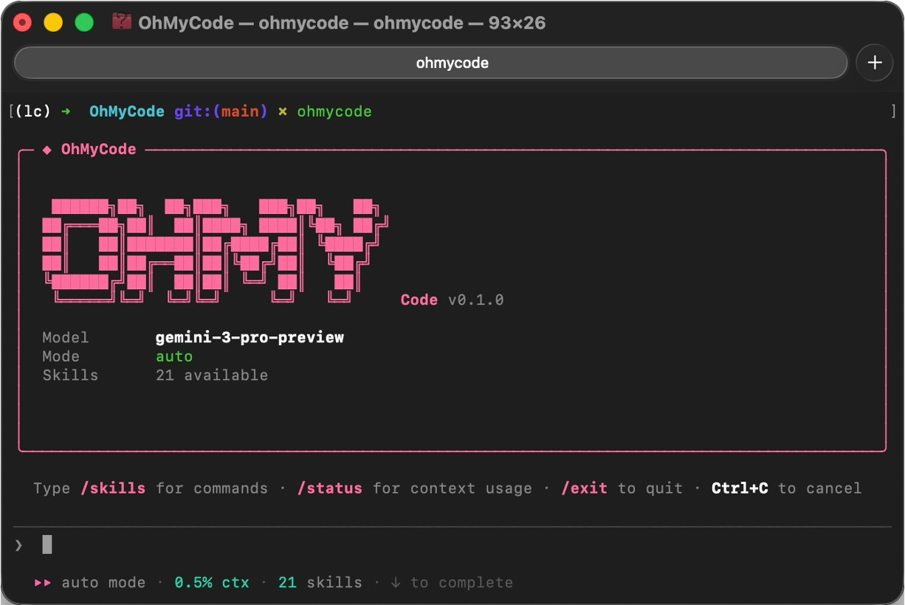

<div align="center">
  <h1 style="display: flex; align-items: center; justify-content: center; gap: 14px; flex-wrap: wrap; margin: 0.5em 0; line-height: 0;">
    
    
  </h1>
  <p><b>Minimal and Customizable CC-Style Coding Agent. That's the entire thing.</b></p>
  <blockquote><i>
    A fully-functional CC-style AI coding assistant you can read in an afternoon — and tell it to extend itself.<br>
    <span style="color:#ec407a;font-style:italic;">"Oh My Code!!!"</span>
  </i></blockquote>
  <p>
    
    
    
    
    
  </p>
</div>

## Why OhMyCode?

🤏 **It's tiny.** OhMyCode delivers the CC-style coding assistant experience — streaming, tool use, context compression, memory — in ~3000 lines you fully own.

🧬 **OhMyCode extends itself.** Tell **OhMyCode** to "add a tool that does X" and it edits *this* repo's source to build one — no plugin SDK, no API boundaries between you and the code.

<div align="center">
  
</div>

## Highlights

- 🧩 **Minimal CC Core** — Streaming output, tool execution, permission modes, context compression, memory, and resume in ~3000 lines.
- 🔧 **Deeply Customizable** — Add your own tools/providers/prompts or just ask OhMyCode to extend itself by editing its own source.
- 🎒 **Skills Included** — Comes with practical built-in skills for add-tool, add-provider, add-feature, debugging, workflow conventions, test generation, and benchmarking.
- 🌐 **Provider Flexibility** — Works with OpenAI, Anthropic, Azure, and OpenAI-compatible APIs.

## Install

```bash
git clone <repo-url>
cd OhMyCode
./scripts/setup-cli.sh
```

> [!TIP]
> This project is CLI-first. Start it with `ohmycode` command only.
> If command is still not found after setup, reload shell and verify:
> `source ~/.zshrc && which ohmycode`
>
> `./scripts/setup-cli.sh` installs a stable global shim at `~/.local/bin/ohmycode`,
> so it works consistently across different shell sessions and conda environments.

## Quick Start

```bash
ohmycode                        # interactive REPL
ohmycode -p "Fix the bug"      # single-shot prompt
ohmycode --resume               # resume last conversation
ohmycode --mode plan            # read-only mode
```

Verify CLI wiring (recommended for agents and CI scripts):

```bash
pip3 show ohmycode | rg "Editable project location|Location"
which ohmycode
ohmycode --help
```

### REPL Commands

| Command | Description |
|---------|------------|
| `/exit & /quit` | Quit (auto-saves + extracts memories) |
| `/clear` | Clear history |
| `/mode <mode>` | Switch mode (`default` / `auto` / `plan`) |
| `/think <level>` | Set reasoning effort: `low` / `medium` / `high` / `off` (o-series / Claude 4) |
| `/memory list\|delete` | Manage memories |
| `/skills` | List skills |
| `/<skill-name>` | Run a skill |

## Configuration

Create `~/.ohmycode/config.json`:

```json
{
  "provider": "openai",
  "model": "gpt-4o",
  "api_key": "sk-...",
  "mode": "auto"
}
```

Config merges four layers: **system defaults** < **user** (`~/.ohmycode/`) < **project** (`.ohmycode/`) < **CLI args**.

CLI overrides: `--provider`, `--model`, `--mode`, `--api-key`, `--base-url`.

<details>
<summary>All config options</summary>

| Key | Default | Description |
|-----|---------|-------------|
| `provider` | `"openai"` | LLM provider |
| `model` | `"gpt-4o"` | Model name |
| `mode` | `"default"` | Permission mode |
| `base_url` | `""` | API base URL |
| `api_key` | `""` | API key |
| `azure_endpoint` | `""` | Azure endpoint |
| `azure_api_version` | `"2024-02-01"` | Azure API version |
| `max_turns` | `100` | Max conversation turns |
| `token_budget` | `200000` | Token budget |
| `output_tokens_reserved` | `8192` | Reserved output tokens |
| `rules` | `[]` | Permission rules |
| `system_prompt_append` | `""` | Appended to system prompt |
| `search_api` / `search_api_key` | `""` | Web search API config |

</details>

## Built-in Tools

| Tool | Description |
|------|-------------|
| `bash` | Shell commands with timeout |
| `read` | Read files with line range |
| `edit` | Find-and-replace (unique match) |
| `write` | Create/overwrite files |
| `glob` | Find files by pattern |
| `grep` | Regex search across files |
| `web_fetch` | Fetch URL → text |
| `web_search` | DuckDuckGo search (set `OHMYCODE_PROXY` if DuckDuckGo is blocked on your network) |
| `agent` | Sub-agent (max depth 2) |

## Extending (or: Let It Extend Itself)

The fastest way to add a feature? **Ask OhMyCode to do it.** It can read its own source, write new files, and run tests — so "add a tool that counts words" is a single prompt away.

You can also do it manually:

- **Add a tool** — create `ohmycode/tools/my_tool.py`, auto-discovered. See `/add-tool` skill.
- **Add a provider** — create `ohmycode/providers/my_provider.py`, auto-discovered. See `/add-provider` skill.
- **Add a skill** — create `SKILL.md` in `.ohmycode/skills/`, `.claude/skills/`, `.agents/skills/`, or `~/.ohmycode/skills/` (searched in that order).

## Project Structure

```
ohmycode/
├── cli.py               # REPL + rendering
├── core/
│   ├── loop.py          # Conversation loop
│   ├── messages.py      # Message types + streaming events
│   ├── context.py       # Token counting + compression
│   ├── permissions.py   # Permission pipeline
│   └── system_prompt.py # System prompt assembly
├── providers/           # OpenAI, Anthropic (auto-discovered)
├── tools/               # 9 built-in tools (auto-discovered)
├── skills/loader.py     # Skill scanner
├── memory/memory.py     # B+-Tree memory + LLM extraction
├── storage/conversation.py  # JSON persistence + resume
└── config/config.py     # Four-layer config merge
benchmarks/
├── run_bench.py         # Benchmark harness (token tracking + scoring)
└── suite.py             # 8 SWE-bench-style task definitions
```

## Testing

```bash
python3 -m pytest tests/ -v          # 190 unit tests
```

### Benchmarking

OhMyCode ships with a built-in benchmark suite — 8 SWE-bench-style coding tasks that test code generation, bug fixing, refactoring, test generation, tool use, and code comprehension.

```bash
python3 benchmarks/run_bench.py                        # full benchmark, current config
python3 benchmarks/run_bench.py --model gpt-4o-mini    # compare a different model
python3 benchmarks/run_bench.py --dry-run              # validate tasks without LLM
```

Or from the REPL: `/bench`

The harness tracks **token usage (in/out)** per task and outputs a scorecard + `bench_results.json` for model comparison.

### Development Closed-Loop

OhMyCode includes skills for a TDD-style development loop:

```
code  →  /gen-tests  →  /run-tests  →  fix  →  repeat
```

| Skill | Purpose |
|-------|---------|
| `/gen-tests <module>` | Generate tests following project conventions |
| `/run-tests [scope]` | Run tests, analyze failures, fix, re-run |
| `/bench` | Score any provider/model with 8 agent tasks |

## License

MIT
